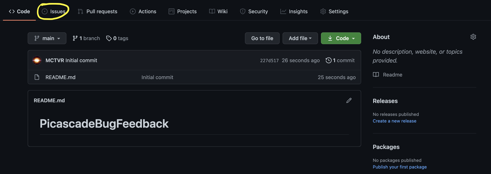
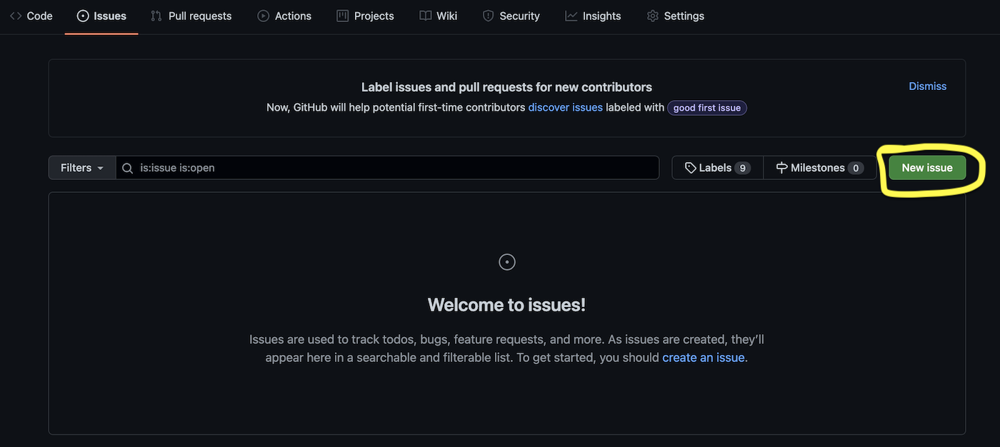
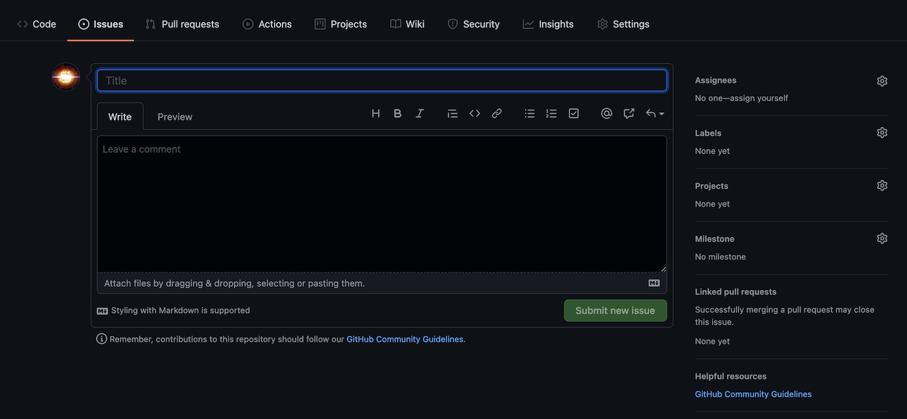

# Picascade Bug Feedback

Welcome to the Picascade Bug Feedback GitHub Repository!

## How to report a Bug in Picascade?

### 1. Click the `Issues` tab

### 2. Click `New Issue`

### 3. Briefly Explain the Bug and How Did the Bug Appear

### 4. Click `Submit new issue` and the Developers in Picascade will follow it up ASAP
